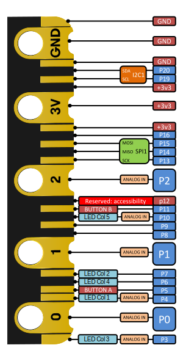

# Sesión 1

[Documentación Técnica sobre micro:bit](https://tech.microbit.org/hardware/)

[Makecode: página para programación y tutoriales](https://makecode.microbit.org)

## Ejemplos

[Carita](https://makecode.microbit.org/S42742-31569-79705-36660)

Para pasar el programa a la micro:bit, la conectamos al USB, pulsamos en los 3 puntos y "Conectar Placa", que la empareja. Nos aparece el logo en el botón Descargar

[Si o No](https://makecode.microbit.org/S68564-13269-65538-83927)

[Dado](https://makecode.microbit.org/S68418-62564-15544-60855)

Para encontrar los bloques podemos usar el buscador (ejemplo con "azar")

Duplicamos el proyecto y añadimos más opciones (Desde la pantalla inicial de Makecode -> Ver todos y ahí seleccionamos y duplicamos)

[Dado + Temperatura + luz ....](https://makecode.microbit.org/S28575-08263-29331-26145)

Añadimos los botones, el botón tactil del logo y la activación de P0 (hacer contacto entre P0 y GND)

[Termostato](https://makecode.microbit.org/S97279-72971-34291-06187)

Usamos bloque condicional ( Si -> entonces/Si no) para hacer una cosa u otra en función de la temperatura.

* Usamos el pin 8 que es el led izquiero de maqueen. En el simulador se ve que se enciende y apaga el pin correspondiente a P8
* Conectamos la placa a maqueen y vemos como al cambiar la temperatura se enciende/apaga el led de maqueen

